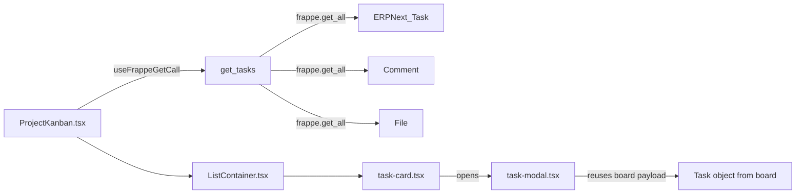

# SprintSpace Architecture

SprintSpace is a Frappe/ERPNext v15 app that provides a Trello-like kanban UI on top of **ERPNext Project + Task**.

## Domain mapping

- **Board**: ERPNext `Project Type`
- **Project**: ERPNext `Project`
- **List/Column**: ERPNext `Task.status` (fixed set used by the kanban UI)
- **Card**: ERPNext `Task`
- **Card ordering**: `Task.custom_kanban_index` (current) — planned migration to `Task.custom_kanban_rank`

Customizations exported in:

- `sprintspace/sprintspace/custom/project_type.json`
- `sprintspace/sprintspace/custom/project.json`
- `sprintspace/sprintspace/custom/task.json`

## Web entrypoint

The SPA is served from a Frappe web route and bootstrapped with the standard Frappe boot object:

- Web controller: `sprintspace/www/sprintspace.py`
- HTML entry: `sprintspace/www/sprintspace.html`
- Route rule: `website_route_rules` in `sprintspace/hooks.py` maps `/sprintspace/<path:app_path>` to the SPA.

## Frontend (React/Vite)

Key pages:

- Boards: `frontend/src/pages/Boards.tsx`
- Projects inside a board: `frontend/src/pages/Projects.tsx`
- Project kanban: `frontend/src/pages/ProjectKanban.tsx`

Key components:

- Project navbar (filters, members): `frontend/src/components/project-navbar.tsx`
- Filter sheet: `frontend/src/components/filter-dialog.tsx`
- Kanban container + drag/drop: `frontend/src/components/list-container.tsx`
- List column: `frontend/src/components/list-item.tsx`
- Card tile: `frontend/src/components/common/task-card.tsx`
- Card modal: `frontend/src/components/modals/task-modal.tsx`

## Backend APIs (current)

All SprintSpace APIs currently live in:

- `sprintspace/api/tasks.py`

Whitelisted methods:

- `sprintspace.api.tasks.get_tasks(project, page, page_size, filters)`
  - Returns kanban lists with cards.
  - Current payload is heavy: includes attachments + full comments arrays for all tasks.
- `sprintspace.api.tasks.add_card(subject, status, project)`
  - Creates a new ERPNext `Task`.
- `sprintspace.api.tasks.update_card_order(tasks)`
  - Bulk updates tasks after drag/drop (status + `custom_kanban_index`).

Frontend also calls built-in Frappe APIs directly:

- `frappe.desk.form.assign_to.add` / `remove` for member assignment (uses Task `_assign`)
- `frappe.desk.form.document_follow.update_follow` for watching
- `useFrappeUpdateDoc("Task", ...)` for title/description/priority/type/due date edits
- `useFrappeFileUpload()` for attachments on Task

## Current data flow (board → modal)

This is the main reason the app will slow down as the number of tasks grows: **board view fetch includes card-detail data**.

